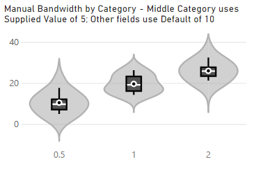

# Usage

---

[Home](../readme.md) | **Usage and Visual Properties** | [Change Log](./change_log.md) | [Privacy Policy](./privacy_policy.md) | [Support](./support.md)

---

## Getting Started

### Fields

The bare minimum you need for a plot is:

-   A measure or value to analyse (add to the **Measure Value** data role).
-   A field to represent the individual level of each value (add to the **Sampling** data role).
-   Optionally, you can add a **Category** field to generate a violin plot for each value group.

### About Sampling

Power BI will aggregate values if something is not supplied to split them by. We therefore need a field to make sure these values are kept separate so that we can do the correct analysis.

Put simply: **the **Sampling** field is needed to prevent Power BI from aggregating your data before it can be analysed**.

Good values for **Sampling** would either be a unique ID such as a primary key or an index column in the query for your table.

This is often a tricky concept to explain quickly **and often why a violin may not look how you expect**, so [a more detailed write-up of the concept is explained here](https://coacervo.co/violin-plot-sampling) and is recommended reading prior to creating an issue with the visual.

### Row Limits

Due to limits within custom visuals, you are conventionally limited to the top 30K samples (rows) from the filtered data set. This can be mitigated by using [Additional Data Fetching](#additional-data-fetching) options detailed below.

### Category Limits

Categories are limited to a maximum of **100** unique values per visual instance.

The primary reason for this is that the kernel density estimation (KDE) for each unique category is computationally expensive. This can cause the visual to become unresponsive for an undesirable amount of time if too many are added - this can be frustrating for users that might be exploring their data and have too many unique category values, or unintentionally getting the **Sampling** and **Category** values the wrong way around (it happens!).

Note that it's also possible that the expected number of categories might not be plotted if your data exceeds the maximum number of samples (30K), or not enough data can be supplied via [Additional Data Fetching](#additional-data-fetching).

In these cases, it is recommended that you filter your data accordingly and use multiple instances of the visual.

## Categories

### Adding Categories

The plot allows you to split your data by category, by adding a suitable field into the **Category** box. This will plot a violin for each unique value, e.g.:

If providing categories, the **Data Colors** menu will offer a **By Category** option. Select this to apply individual colors, e.g.:

### Sorting Categories

If specifying a category, the visual will sort in ascending order of category name by default. You can change this by using the Sorting menu, which becomes visible if your plot contains categories.

Current options are:

-   Category
-   Samples
-   Median
-   Mean
-   Maximum
-   Minimum

For any sort value, you can specify **Ascending** or **Descending** order.

## Tuning Your Violin

The distribution of your data can have a very big effect on the shape, or "effectiveness" of your kernel density plot. The first of these is the choice of [kernel](<https://en.wikipedia.org/wiki/Kernel_(statistics)#In_non-parametric_statistics>) (window function) that can be applied to your data when smoothing.

The sampling resolution (or bins) can also have an effect on the shape your line may take.

The kernel also has a [bandwidth](https://en.wikipedia.org/wiki/Kernel_density_estimation#Bandwidth_selection) parameter, which can have a sometimes drastic effect on the resulting estimate produced.

As a result, it is sometimes tricky to produce a good "out of the box" violin plot and as such, this visual provides some options in the Violin Options menu to help those who need a bit more control.

### Kernels

The visual provides 4 different kernels:

### Sampling Resolution

There are 3 different options for the sampling resolution:

The above visuals are using the **Epanechnikov** (default) kernel, with an overridden bandwidth in order to help illustrate the differences in resolution (more on that below).

At higher resolutions, more features within the data are attempted to be identified but this may sometimes not be desirable, depending on your visualization objectives.

The distribution and features of your data will invariably have an effect on the usefulness of this in all cases, but provides you with another facet on which to apply your analysis.

### Clamping

The 'tail' of each side of the plot is due to the kernel smoothing of your data distribution. If we just stop at the min/max values, we run the risk of potentially miscommunicating the modality of your data, so the KDE is projected outwards, based on the trajectory of your data to a convergence point.

If you wish to constrain the data to these limits, you can enable the **Clamp to Min/Max** property in **Violin Options**, e.g.:

Please bear in mind that while this may be desirable for your particular use case, sharply cutting the KDE plot when it cannot converge "naturally" may hide insights about the modality (shape) of your data. As such, it is disabled by default.

### Bandwidth

The "correct" bandwidth can be hard to determine automatically, so the visual will by default apply a "rule-of-thumb" estimation of the bandwidth and apply this to your data. If you wish to tune the bandwidth, then you can select the **Specify Bandwidth** option to override this estimation.

For example, here's the previous example with its estimated bandwidth value of **4.8**, and further examples of how overridden values will have an effect on the plot:

As you can see, results can vary significantly when the bandwidth is modified. The estimated one in this case does quite a good job, but sometimes tuning it may help to further assist with identifying features in a more granular way, or to help smooth out the plot a bit more, in the case of overestimation.

#### Identifying Bandwidth Values

You can see the bandwidth values by enabling the **KDE Bandwidth** option in the [Default Tooltip Details](#tooltips) menu.

If **Specify Bandwidth** is enabled, both the specified and estimated bandwidth will be shown in the tooltip, to help you to compare your manually specified value vs. what the visual calculated, e.g.:

#### Applying Bandwidth by Category

If you're plotting by multiple categories, the **Bandwidth by Category** property is made available underneath the other bandwidth properties. If **Specify Bandwith** is set to _OFF_, then this will calculate the "rule-of-thumb" estimation against each individual category, e.g.:

If **Specify Bandwidth** is set to ON, then you will have the option to provide a manual value for each category, e.g.:

Note that the original **Bandwidth** property serves as a default for all categories, unless that particular category has been manually overridden. If you wish to 'revert' a category you've manualy specified back to the default, delete the entire value so that the field goes blank. It will replace itself with the default.

## Combo Plots

The **Combo Plot** properties menu contains a **Plot Type** setting, which allows you to specify options for the accompanying plot.

Examples of property availability are shown below but you can also turn the combo plot off, should you wish to do so.

### Box Plot (Default)

This will display the conventional box plot that would normally be part of a violin plot. A number of other options are provided in order to help you tailor this to your liking, e.g.:

### Barcode Plot

This will render your individual data points as a barcode (or strip) plot within the violin, e.g.:

The barcode plot does not include the mean as a property..

### Column Plot

This will render a column that spans the min/max values, e.g.:

Note that for the column plot, mean, median and quartiles can be combined and formatted as the other plots, but as they have already been illustrated in previous examples, they have been omitted for brevity.

## Tooltips

### Why are There 2 Tooltip Property Menus?

This visual contains 2 tooltip-related property menus:

-   **Tooltip** (the standard Power BI menu)
-   **Default Tooltip Details** (known as the Tooltip menu in versions of this visual prior to 1.2.0)

Power BI Desktop (March 2019) [introduced improved tooltip formatting options](https://powerbi.microsoft.com/en-us/blog/power-bi-desktop-march-2019-feature-summary/#tooltipFormatting). We recently saw the [introduction of report page tooltips as well](https://docs.microsoft.com/en-us/power-bi/desktop-tooltips).

In order to take advantage of these features in the violin plot, we need to add in the standard Tooltip menu from Power BI. This will allow you to customise the tooltip look and feel - including report page tooltips, if you would like to use them - in the same way you would for other visuals.

Custom visuals cannot integrate well with standard property menus at this time (we can add properties but can't use the behavior of standard properties to show/hide others). As such, it hinders the user experience somewhat if we can't disable or enable our custom properties in this way, so we have kept our custom tooltip properties to their own menu.

If using a Default-type tooltip (i.e. not a report page) then the violin plot-specific tooltip data points are configurable under the **Default Tooltip Details** menu.

### Customizing Default Tooltips

The **Default Tooltip Details** menu provides a number of data points you can enable or disable as required:

-   Maximum & Minimum (Default)
-   Span (Min to Max)
-   Median (Default)
-   Mean (Default)
-   Standard Deviation (Default)
-   Upper & Lower Quartiles
-   Inter Quartile Range
-   Whisker (Confidence) Values
-   KDE Bandwidth (Refer to [Bandwidth](#bandwidth) above for more details)

If using Barcode combo plot:

-   Data Point Value
-   Number of Samples with Highlighted Value

## Legend

Whilst violin plots should be simple to interpret, users who are new to them may not be familiar with the annotations used for mean, median and quartiles.

The **Legend** menu includes a **Show Statistical Data Indicators** property (enabled by default), which allows you to configure textual descriptors for these annotations, if you want to include them. You also have the option to show/hide categories while showing the statistical indicators, e.g.:

## Additional Data Fetching

As noted above, visuals have a standard cap of 30K rows imposed by Power BI on the DAX query that generates its dataset. If your query contains more rows than this, you will see the standard warning in the visual header on hover, e.g.:

It is possible to break this limit, but this is still subject to how much data Power BI is prepared to provide the visual, based on current memory consumption and data model performance.

### Enabling Additional Data Fetching

**As of version 1.4.0**, if your query contains more than 30K samples, you can enable the **Additional Data Fetching** property in the **Data Fetching Options** menu.

If enabled, the Violin Plot will request Power BI to incrementally fetch additional data from the query result and add to the dataset. Power BI will supply approximately 30K additional rows per fetch until it has determined that either all rows have been fetched, or it feels it cannot safely supply any more rows.

The functionality is outlined below, but first, some things to consider...

### Important Points to Note

Some of this will make sense as you read on further, but please read this first to ensure that you're aware of the performance implications of Additional Data Fetching.

-   **Power BI will always re-query data when properties are changed**, as they may contain conditional formatting. If you are customizing your visual's appearance, it is best to disable the **Additional Data Fetching** property.

-   Enabling **Additional Data Fetching** causes Power BI to recursively run filtered queries against your dataset rather than a single `TOP N` for the standard 30K cap.

    -   These can be much more expensive than the standard (limited) query.
    -   So, even though the Violin Plot might cap the row count to something sensible via limiting the number of fetches, if your query has to scan a table of extremely high cardinality then this still may result in very slow data fetches.
    -   There is not much more that we can do about this from the visual side of things, as all data access is delegated by Power BI (for good reason).

-   Capped data may not represent the true distribution and/or modality. If it's possible to pre-emptively filter or slice your data, or use additional visual instances, this can help mitigate such challenges.

### Fetch Progress

During the fetch process, the Violin Plot will provide an update as to how many rows have been supplied by Power BI, e.g.:

Note that the notes underneath the loading progress details can be disabled by turning off the **Show Data Fetching Notes** property. They are enabled by default for your benefit as a report creator but it will most likely be beneficial to switch this off for your end users.

### # of Data Fetches

As Power BI fetches data in batches, the visual has the **Limit # of Data Fetches** property set to _ON_, and the **Maximum # of Data Fetches** set to _10_, effectively providing a secondary cap of approximately 300K rows. This is in-place for performance reasons, as Power BI will always supply data when a visual is affected by elgible external events, and changing visual properties is one of these events.

If you want to remove the secondary cap, you can disable **Limit # of Data Fetches** and Power BI will continue as long as possible to load data into the visual. Please refer to [Important Points to Note](#important-points-to-note) above when attempting this.

### Upon Completion of Additional Fetching

Data fetching can end in one of two states:

1. Power BI is able to supply all data to your visual, or yor specified **Maximum # of Data Fetches** has run to completion. In this case, the visual this will appear as normal, e.g.:
   \
   \
   

2. Due to memory or performance reasons, Power BI is not able to supply all rows. In this case the visual header will still contain a warning, and this will also inform the amount of rows that have been loaded, e.g.:
   \
   \
   
