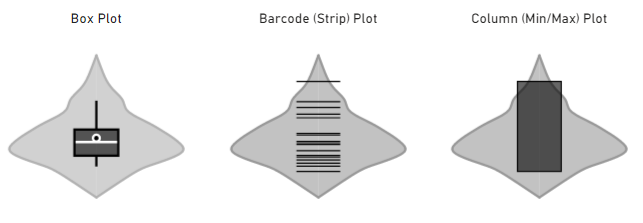

# Violin Plot for Power BI

By Daniel Marsh-Patrick

 [dm-p](https://github.com/dm-p) &nbsp;&nbsp;&nbsp;&nbsp;&nbsp;  [@the_d_mp](https://twitter.com/the_d_mp) &nbsp;&nbsp;&nbsp;&nbsp;&nbsp;  [daniel-m-p](https://www.linkedin.com/in/daniel-m-p) &nbsp;&nbsp;&nbsp;&nbsp;&nbsp; www.coacervo.co | [daniel@coacervo.co](mailto:daniel@coacervo.co)

---

**Home** | [Usage and Visual Properties](./doc/usage.md) | [Change Log](./doc/change_log.md) | [Privacy Policy](./doc/privacy_policy.md) | [Support](./doc/support.md)

---

## Current Status

|                                     | Development | Submitted | Approved | Available |
| ----------------------------------- | :---------: | :-------: | :------: | :-------: |
| [1.4.0](./doc/change_log.md#140)    |     🚧      |           |          |           |
| [1.3.0.4](./doc/change_log.md#1304) |             |           |          |     ✔     |

> **If a version is in any status other than _Available_ this cannot be imported via file or via the Marketplace, even if the listing is showing the new version**. [More on this below](#More-About-Current-Status).

## What the Visual Does

A violin plot is a visual that traditionally combines a [box plot](https://en.wikipedia.org/wiki/Box_plot) and a [kernel density plot](https://en.wikipedia.org/wiki/Kernel_density_estimation).

A box plot lets you see basic distribution information about your data, such as median, mean, range and quartiles but doesn't show you how your data looks throughout its range. If you have a multimodal distribution (multiple peaks) or some confusion as to where things are clustered then it's not easy to figure this out.

A kernel density plot helps with this challenge by showing the variations in your data across its distribution. It works like a histogram, but uses [kernel smoothing](https://en.wikipedia.org/wiki/Kernel_smoother) to provide a smoother curve where noise might otherwise be present.

This custom visual gives you the means to generate a violin plot, with three accompanying combo plots:

The box plot illustrates:

-   The range between the first and third quartiles (box)
-   Median (white line)
-   Mean (white circle)
-   5% and 95% confidence ranges (whiskers)

The barcode plot shows the individual data points rather than a summary of their distribution. You can apply additional annotations for median & quartiles, should you wish to see these as well (more on this on the [Usage and Visual Properties](./doc/usage.md) page).

The column plot shows the span of data from the minimum to the maximum value. Similar to the barcode plot, you can further annotate with mean, median and quartiles if you need these in the same plot.

The shape around the combo plot represents the kernel density plot and shows that the majority of our data is clustered around or below the median.

## Obtaining the Visual

The latest version of the visual is **1.3.0.4**.

The visual is [available in AppSource](https://appsource.microsoft.com/en-us/product/power-bi-visuals/WA104381947) (Power BI Marketplace). You can also download from this repository's [Releases section](https://github.com/dm-p/powerbi-visuals-violin-plot/releases).

Please read the below or review the [Current Status](#Current-Status) table prior to attempting to load a version other then the one in the Marketplace, [or refer to this excellent article by OKViz](https://okviz.com/blog/updating-power-bi-custom-visuals/), which explains the process in much more detail.

## More About Current Status

Custom visuals have a somewhat unconventional path to the Marketplace, and the [Current Status](#Current-Status) table above tries to mirror this as simply as possible. This process takes as long as it takes and is entirely dependent on the current backlog of work with the Custom Visuals Team at Microsoft.

If a custom visual is published to the Marketplace, **it will always be loaded from there**, even if you manually upload a specific version into your report. This is to ensure that reports are always using the latest version and the user doesn't have to manually upgrade all reports containing a particular visual when new versions become available.

If you want to load a version of this visual before it's fully available (or downgrade), you'll need to use [organizational custom visuals](https://docs.microsoft.com/en-us/power-bi/power-bi-custom-visuals-organization) in conjunction with your administrator, which will prioritise the version in your tenant over the one in the Marketplace. You can also use the [Developer Mode feature in Power BI Desktop](https://docs.microsoft.com/en-us/power-bi/developer/visuals/submission-testing?WT.mc_id=DP-MVP-5003712#enable-developer-mode-in-power-bi-desktop) to temporarily load the visual from a local file for a single editing session.

Here's a bigger explanation for anyone who wants to know about what each status means:

-   **Development** - the specified version is undergoing active development and is not in the AppSource/Marketplace ecosystem. Development builds may be available via releases [Releases](https://github.com/dm-p/powerbi-visuals-smlc/releases) or can be compiled from source.
-   **Submitted** - the visual has been submitted to AppSource and is undergoing initial review.
-   **Approved** - the visual listing is updated **but not yet fully available while MS do internal testing and verification**.
-   **Available** - the visual is fully available and can be obtained from the marketplace as normal. Any reports using the visual will be automatically updated.
